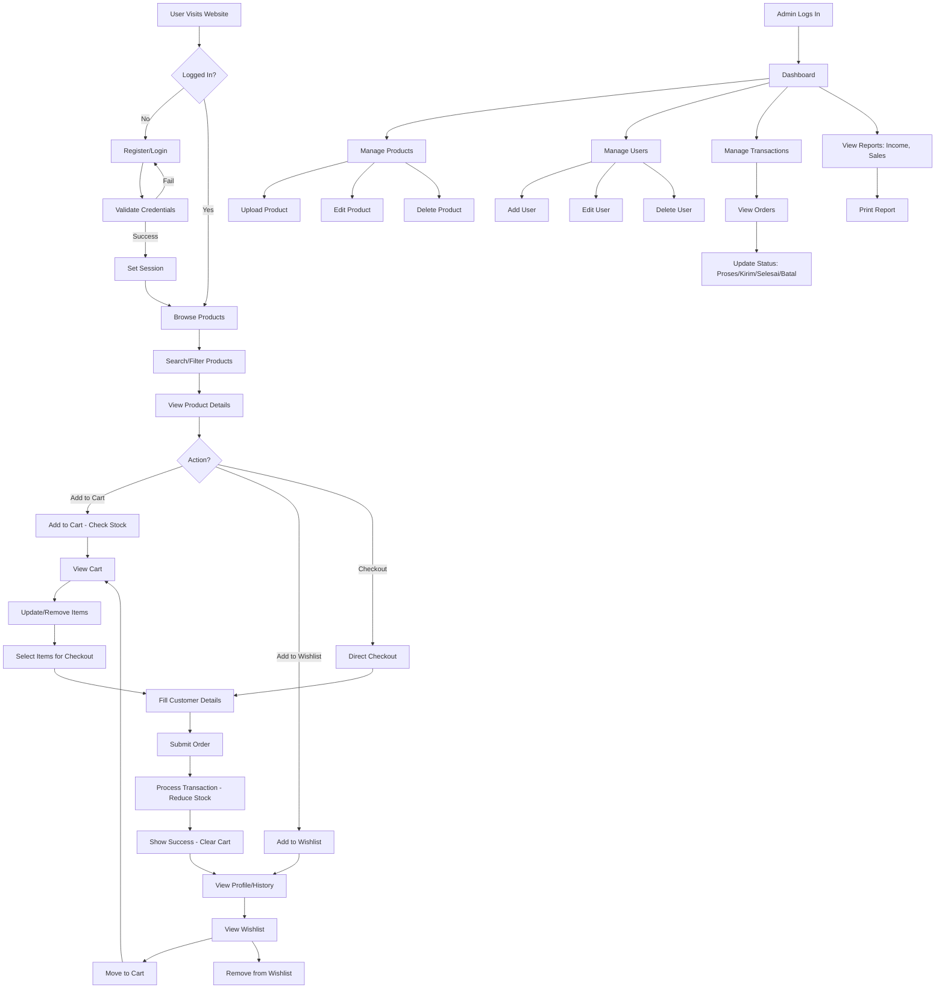

# Activity Flow Diagram for Dealer Motor Zulfa Website

This document outlines the main activity flows for the Dealer Motor Zulfa website, covering user interactions, admin operations, and transaction processes. The flows are described textually and visualized using Mermaid diagram syntax.

## Overview
The system has two main actors:
- **User (Customer)**: Registers, browses products, manages cart, places orders, views profile.
- **Admin**: Manages products, users, transactions, and system settings.

## Main Activity Flows

### 1. User Registration and Login Flow
1. User visits the website.
2. If not logged in, user can register or login.
3. Registration: Fill form (name, email, password, phone, address) → Validate → Save to DB → Redirect to login.
4. Login: Enter email/password → Verify → Set session → Redirect to home.
5. If login fails, show error and retry.

### 2. Product Browsing and Search Flow
1. User logs in (optional for browsing).
2. User browses products on index.php or produk.php.
3. User can search by keyword (name, merk, category).
4. Results displayed in grid/cards.
5. User clicks product for details (produk_detail.php).
6. On detail page: View description, specs, stock, price.
7. User can add to cart, checkout directly, or add to wishlist (if logged in).

### 3. Cart and Checkout Flow
1. User adds product to cart (produk_keranjang.php).
2. Cart checks stock availability.
3. User can update quantities or remove items.
4. User selects items and proceeds to checkout (checkout.php).
5. Fill customer details (name, phone, address, notes).
6. Submit order → Process transaction (admin/transaksi_add.php).
7. Reduce stock, save transaction details, clear cart.
8. Show success message, redirect to profile.

### 4. Transaction Management Flow
1. After checkout, transaction status: 'proses'.
2. Admin views transactions (admin/transaksi.php).
3. Admin can update status: 'kirim' or 'selesai'.
4. If issue, admin can cancel ('batal') with reason.
5. User views transaction history in profile (profil.php).
6. For cancelled orders, user sees reason.

### 5. Admin Product Management Flow
1. Admin logs in (admin/login.php).
2. Admin accesses dashboard (admin/index.php).
3. Manage products: Upload new (produk_upload.php), edit (produk_edit.php), delete (produk_delete.php).
4. Manage brands (merk.php, merk_add.php, merk_update.php, merk_delete.php).
5. View product sales (produk_terjual.php).

### 6. Admin User Management Flow
1. Admin views users (admin/user.php).
2. Can add new user (user_add.php), edit (user_update.php), delete (user_delete.php).
3. Delete also removes related cart items.

### 7. Profile and Wishlist Flow
1. User views profile (profil.php): Edit details, change password, upload photo.
2. Wishlist: Add from product detail, view in profile, remove items.
3. User can move wishlist items to cart or checkout directly.

### 8. Reporting and Settings Flow
1. Admin views income reports (pendapatan.php) by month/week/year.
2. Admin manages own account (pengaturan.php): Change email/password.
3. Print reports or transaction receipts (struk.php).

## Mermaid Activity Diagram

## Notes
- All database interactions use MySQLi prepared statements for security.
- Sessions manage user state.
- Stock is checked before adding to cart or processing orders.
- Transactions are immutable once processed; cancellations require admin action.
- The system uses Bootstrap for UI and PHP for backend logic.

This activity flow covers the core functionalities. For more detailed sub-flows, additional diagrams can be created.
